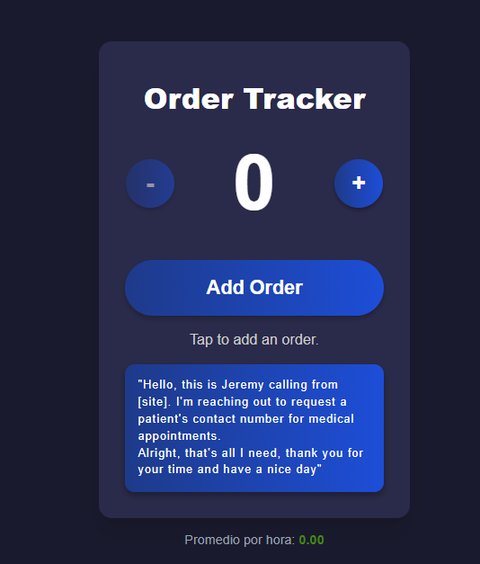

# 📦 Contador de ordenes - Jeremy

Este proyecto es una aplicación web sencilla pero funcional, diseñada para contar ordenes de manera interactiva, visualizar el progreso diario hacia una meta, y calcular el rendimiento promedio responsive y mobile-first. Está hecho en **HTML, CSS y JavaScript puro**, sin frameworks.

## 🚀 Características

- Contador de pedidos incrementable y decrementable manualmente.
- Meta diaria configurable (por defecto: 80 pedidos).
- Cambia el color del número a verde cuando se alcanza la meta.
- Visualiza el tiempo desde el último pedido.
- Calcula el promedio de pedidos por hora.
- Interfaz responsive con estilo moderno (modo oscuro).
- Efectos visuales cuando se alcanzan múltiplos de 10.
- Actualización automática del estado cada segundo.

---

## 📂 Estructura de Archivos

📁 contador-pedidos/
├── index.html # Página principal con estructura HTML
├── style.css # Estilos personalizados
├── main.js # Lógica JavaScript del contador
└── README.md # Documentación del proyecto


---

## 📸 Captura de Pantalla

*Funcionamiento .*
// hacer un hover o pasar el mouse por encima para ver la imagen

---

## ⚙️ Cómo Usar

1. Clona el repositorio o descarga los archivos:

```bash
git clone https://github.com/tu-usuario/contador-pedidos.git
